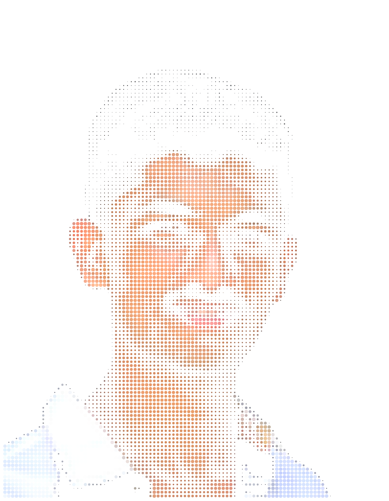
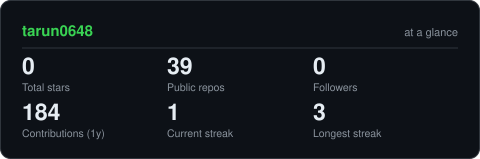
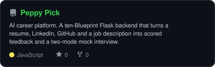
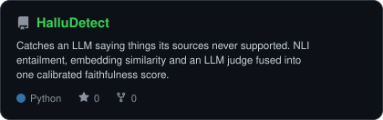
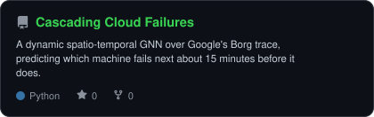
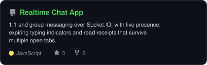

<div align="center">

<!-- PORTRAIT - generated by scripts/dotify.py from assets/tarun.png, whose grey
     studio backdrop was cut to alpha by scripts/cutout.py first. Colour mode, so
     one file serves both GitHub themes. No --reveal: it animates rows up from
     opacity 0, which leaves the portrait blank wherever CSS animation in an 
     does not run. Regenerate with:
       python scripts/dotify.py assets/tarun.png -o assets/portrait \
         --cols 100 --equalize --detail 0.5 --color -->


<br>

<!-- NAME / TAGLINE - animated typing -->
<a href="https://github.com/tarun0648">
  
</a>

<br>

<!-- SOCIALS -->
<a href="https://linkedin.com/in/taruns0648"></a>
<a href="mailto:taruns0648@gmail.com"></a>
<a href="https://taruns.xyz"></a>
<a href="https://taruns.xyz/resume.pdf"></a>


</div>

---

## `~/` whoami

```console
$ cat about.txt
```

Hi, I'm **Tarun S**. I'm a Computer Science (AI & ML) undergrad at **PES University, Bangalore**, and I build
full-stack products with LLMs wired into them — the kind that keep working when the model, the database or the
mail server decides not to.

- Currently building my **[AI-powered portfolio](https://taruns.xyz)** — Next.js + Express/Firestore, with a grounded chat assistant that answers questions about my work
- Two full-stack internships: **Zinnovate Ventures** (backend for an AI career platform) and **Bright Nodes** (JWT/OTP auth infrastructure, HR and e-commerce APIs)
- Mostly writing **Python/Flask**, **Node/Express** and **React/Next.js**, against **OpenAI**, **Claude** and **NVIDIA NIM**
- Open to **internships and freelance work** — graduating June 2027
- Fun fact: **I wrote a multiplayer Rock Paper Scissors server over raw C sockets before I ever touched a web framework.**

<br>

<div align="center">

## `~/` toolbox


</div>

---

<div align="center">

## `~/` skill radar

<table>
<tr>
<td width="50%" align="center" valign="middle">

<!-- Self-rated radar - edit assets/skills.json, the workflow redraws it -->
<picture>
  <source media="(prefers-color-scheme: dark)"  srcset="assets/radar-dark.svg">
  <source media="(prefers-color-scheme: light)" srcset="assets/radar-light.svg">
  
</picture>

</td>
<td width="50%" align="center" valign="middle">

<!-- Live radar built from real language byte counts across your repos -->
<picture>
  <source media="(prefers-color-scheme: dark)"  srcset="assets/radar-langs-dark.svg">
  <source media="(prefers-color-scheme: light)" srcset="assets/radar-langs-light.svg">
  
</picture>

</td>
</tr>
</table>

</div>

---

<div align="center">

## `~/` contribution calendar

<!-- 3D isometric calendar, regenerated every 6h by .github/workflows/metrics.yml -->


<br><br>

<!-- Snake eats the contribution graph - .github/workflows/snake.yml -->
<picture>
  <source media="(prefers-color-scheme: dark)"  srcset="https://raw.githubusercontent.com/tarun0648/tarun0648/output/snake-dark.svg">
  <source media="(prefers-color-scheme: light)" srcset="https://raw.githubusercontent.com/tarun0648/tarun0648/output/snake.svg">
  
</picture>

</div>

---

<div align="center">

## `~/` the numbers

<!-- Generated by scripts/cards.py into this repo. Deliberately NOT
     github-readme-stats / streak-stats / github-profile-trophy: those are
     shared public instances that go down and take the whole section with them. -->
<picture>
  <source media="(prefers-color-scheme: dark)"  srcset="assets/card-stats-dark.svg">
  <source media="(prefers-color-scheme: light)" srcset="assets/card-stats-light.svg">
  
</picture>

<br>


</div>

---

<div align="center">

## `~/` selected work

<!-- Cards generated by scripts/cards.py from assets/projects.json.
     Stars, forks and language are pulled live from the API on every run. -->
<table>
<tr>
<td width="50%">
  <a href="https://github.com/tarun0648/SkillBuddy-Frontend-Backend">
    <picture>
      <source media="(prefers-color-scheme: dark)"  srcset="assets/card-SkillBuddy-Frontend-Backend-dark.svg">
      <source media="(prefers-color-scheme: light)" srcset="assets/card-SkillBuddy-Frontend-Backend-light.svg">
      
    </picture>
  </a>
</td>
<td width="50%">
  <a href="https://github.com/tarun0648/HalluDetect">
    <picture>
      <source media="(prefers-color-scheme: dark)"  srcset="assets/card-HalluDetect-dark.svg">
      <source media="(prefers-color-scheme: light)" srcset="assets/card-HalluDetect-light.svg">
      
    </picture>
  </a>
</td>
</tr>
<tr>
<td width="50%">
  <a href="https://github.com/tarun0648/CascadingCloudFailures--Deep-Learning-on-Graphs---Project-">
    <picture>
      <source media="(prefers-color-scheme: dark)"  srcset="assets/card-CascadingCloudFailures--Deep-Learning-on-Graphs---Project--dark.svg">
      <source media="(prefers-color-scheme: light)" srcset="assets/card-CascadingCloudFailures--Deep-Learning-on-Graphs---Project--light.svg">
      
    </picture>
  </a>
</td>
<td width="50%">
  <a href="https://github.com/tarun0648/Chatapp-Using-React-Flask-Sockets-I">
    <picture>
      <source media="(prefers-color-scheme: dark)"  srcset="assets/card-Chatapp-Using-React-Flask-Sockets-I-dark.svg">
      <source media="(prefers-color-scheme: light)" srcset="assets/card-Chatapp-Using-React-Flask-Sockets-I-light.svg">
      
    </picture>
  </a>
</td>
</tr>
</table>

<sub>

| project | what it is | stack |
|---|---|---|
| **[Peppy Pick](https://github.com/tarun0648/SkillBuddy-Frontend-Backend)** | AI career platform — resume/LinkedIn/GitHub analysis and a two-mode interview simulator | `Flask` `Firestore` `Claude` `OpenAI` |
| **[HalluDetect](https://github.com/tarun0648/HalluDetect)** | LLM hallucination detection — NLI + embeddings + an LLM judge, fused into one calibrated score | `Python` `Transformers` `FAISS` `Flask` |
| **[Cascading Cloud Failures](https://github.com/tarun0648/CascadingCloudFailures--Deep-Learning-on-Graphs---Project-)** | Dynamic spatio-temporal GNN predicting cloud machine failures ~15 min ahead | `PyTorch Geometric` `GraphSAGE` `GRU` |
| **[Realtime Chat App](https://github.com/tarun0648/Chatapp-Using-React-Flask-Sockets-I)** | 1:1 and group chat with live presence, typing indicators and read receipts | `React` `Flask-SocketIO` `MySQL` |
| **[Sleep Stage Detection](https://github.com/tarun0648/AFML-COURSE-PROJECT---Robust-Sleep-Stage-Detection-from-Scarce-Imbalanced-EEG-Data)** | VAE augmentation + SimCLR pretraining for the rare EEG sleep stages | `PyTorch` `MNE` `SimCLR` |
| **[Dynamic FAQ Builder](https://github.com/tarun0648/Dynamic-FAQ-Builder---SE-Project--FINAL)** | Hand-rolled TF-IDF relevance search with a Gemini fallback answerer | `React` `Express` `Firestore` `Gemini` |
| **[Plastic Waste Flow](https://github.com/tarun0648/Plastic-Waste-Flow-Recycling-Prediction--ADA-COURSE-PROJECT)** | Trade-network analysis and ARIMA/Prophet/LSTM forecasting on global plastic waste | `NetworkX` `Prophet` `Plotly Dash` |
| **[Audio Customizer](https://github.com/tarun0648/Audio-Customizer)** | Browser audio editor — trim, speed, fade, reverse and pitch, all FFmpeg-driven | `React` `Express` `MongoDB` `FFmpeg` |

</sub>

</div>

---

<div align="center">

<sub>`01110100 01101000 01100001 01101110 01101011 01110011 00100000 01100110 01101111 01110010 00100000 01110011 01100011 01110010 01101111 01101100 01101100 01101001 01101110 01100111`</sub>

</div>
